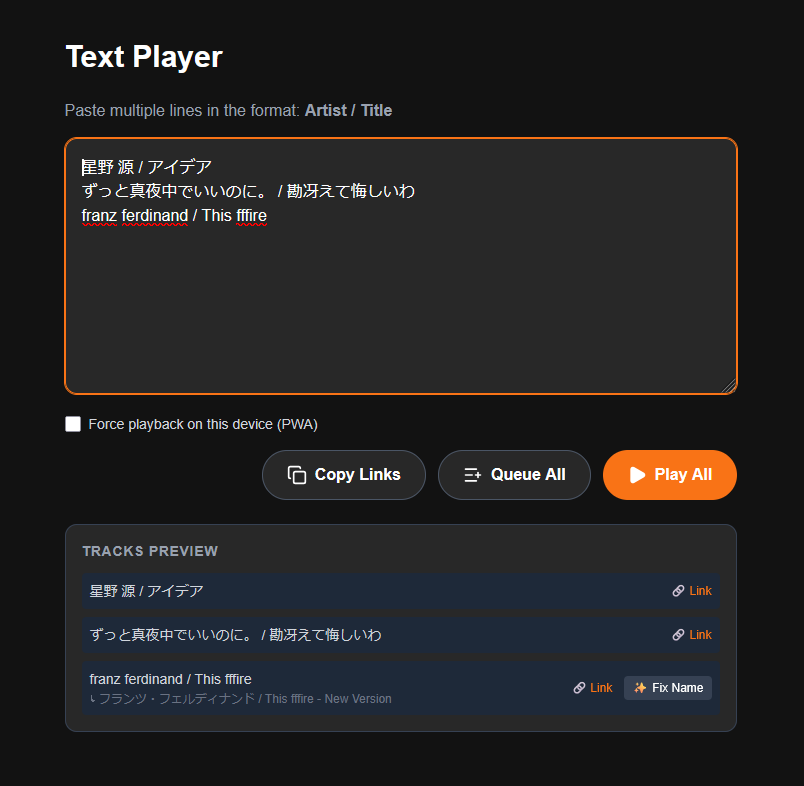

# Text Spotify Player

*[日本語版はこちら (Read this in Japanese)](README.ja.md)*

A text-based Spotify player. Paste multiple lines of text in the format `Artist / Title` (or `Artist - Title`) to easily play them all at once or add them to your queue.



## Basic Usage

1. Open the app in your browser and click "Login with Spotify". (*Note: You need a **Spotify Premium** account to play music.*)
2. Enter the songs you want to play into the text area like this:
   ```text
   The Beatles / Let It Be
   Queen - Bohemian Rhapsody
   ```
3. Click **"Play All"** to start playing the entered songs.
4. Click **"Queue All"** to add all the entered songs to your playback queue.
5. Click **"Copy Links"** to copy the Spotify links of all the entered songs to your clipboard.

## Local Environment Setup

Follow these steps to run the app on your local machine.

1. Clone or download this repository.
2. Install the dependencies:
   ```bash
   npm install
   ```
3. Create an app on the [Spotify Developer Dashboard](https://developer.spotify.com/dashboard) and get your Client ID.
   - Make sure to set the Redirect URI to `http://127.0.0.1:5173/`.
4. Create a `.env` file in the project root and add your Client ID:
   ```env
   VITE_SPOTIFY_CLIENT_ID=your_client_id_here
   ```
5. Start the development server:
   ```bash
   npm run dev
   ```
6. Open `http://127.0.0.1:5173/` in your browser.

## Deployment

This project can be easily deployed to static hosting services like Vercel. Here is an example using Vercel:

1. **Prepare the Repository**:
   Fork (or push) this repository to your own GitHub account.

2. **Spotify Settings**:
   Go to the [Spotify Developer Dashboard](https://developer.spotify.com/dashboard) and create a new application.
   - Add your deployment URL (e.g., `https://your-project-name.vercel.app/`) to the **Redirect URIs** and save it.
   - Copy the **Client ID** from the settings page.

3. **Deploy with Vercel**:
   - Go to the Vercel dashboard, click `Add New...` > `Project`, and import your prepared repository.
   - Open the "Environment Variables" section and add the following:
     - Name: `VITE_SPOTIFY_CLIENT_ID`
     - Value: (The Client ID you copied)
   - Click "Deploy".

4. **Verify**:
   Once the deployment is complete, access the provided URL and ensure you can log in and play music.

## Tech Stack
- React 19 + TypeScript + Vite
- Tailwind CSS
- Spotify Web API TS SDK
